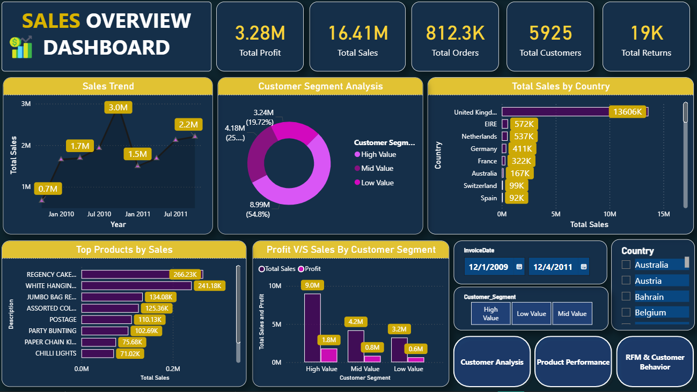
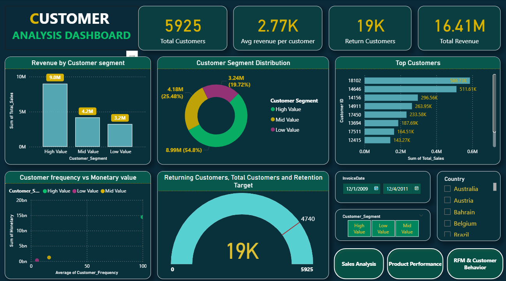
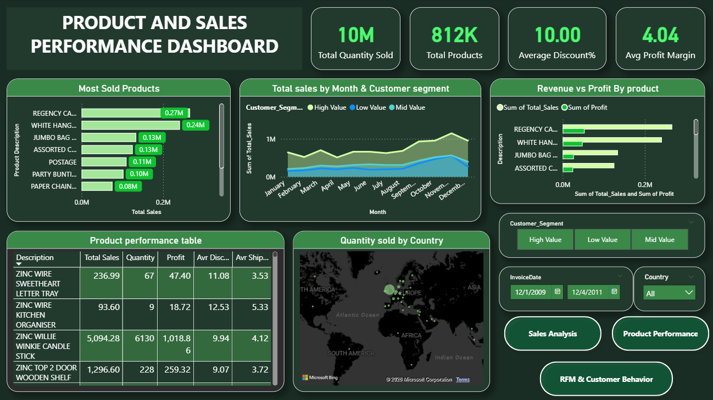
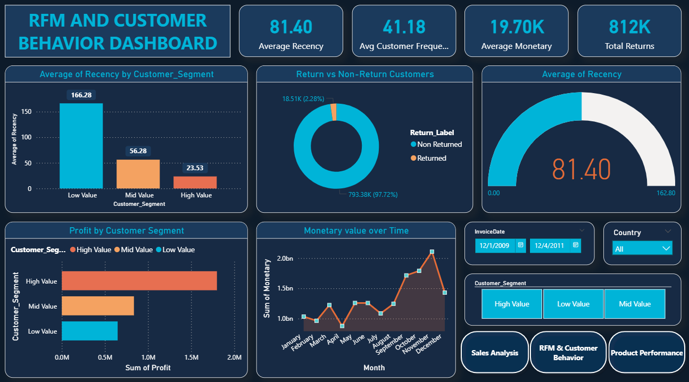

# Smart Sales & Customer Analytics System

## Overview
This project analyzes sales performance, customer behavior, product trends, and RFM segmentation using Python and Power BI.

## Features
- Sales Analysis Dashboard
- Customer Segmentation
- Product Performance Analysis
- RFM Customer Analysis

## Technologies Used
- Python
- Pandas
- NumPy
- Matplotlib
- Power BI

## Dashboards
The project includes interactive dashboards for:
## Dashboard Preview

### Sales Dashboard

### Customer Dashboard

### Product Dashboard

### RFM Dashboard

## Project Components
- Data preprocessing using Python
- Interactive Power BI dashboards
- Project report and presentation

Note: A sample dataset is provided in this repository due to GitHub file size limitations.
## Author
Aman Semwal
